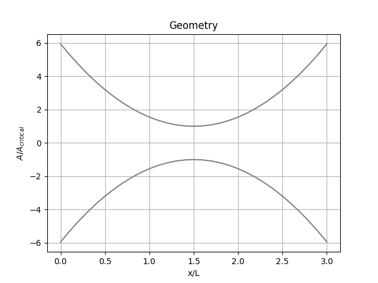
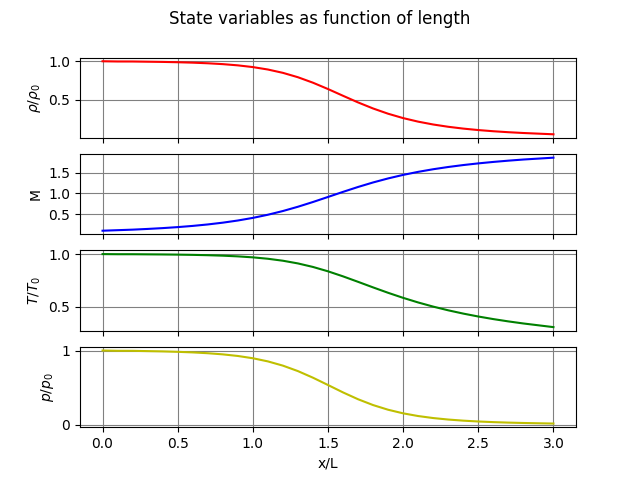

# Quasi-one-dimensional nozzle flow
The goal of this project is to solve instationary quasi-one-dimensional flow in a nozzle using the MacComack-method. The method is described in John D. Anderson, JR., "Computational Fluid Dynamics: THE BASICS WITH APPLICATIONS", McGraw-Hill

# Project 2
