# Quasi-one-dimensional nozzle flow
The goal of this project is to solve instationary quasi-one-dimensional flow in a nozzle using the MacCormack-method. The method is described in [1]. 

Nozzle flow             |
:-------------------------:|
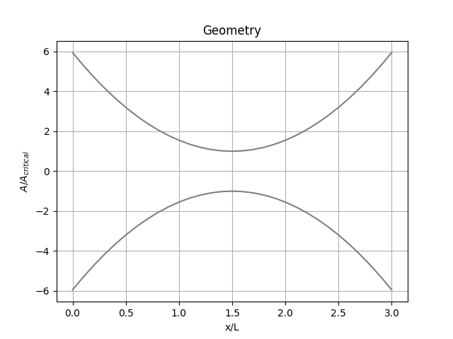 |
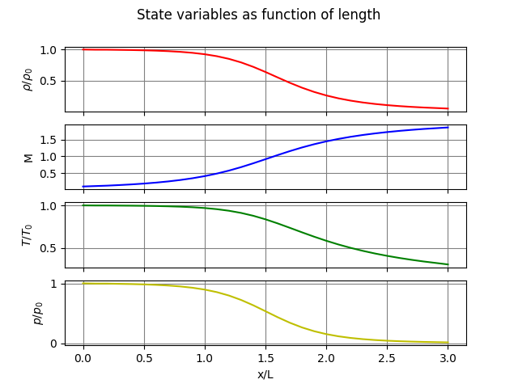 |

# Navier-Stokes using artificial compressibility
This project solves the Navier-Stokes equations using the artificial compressibility method. A simple pre- and post-processor is also implemented within the program. The results for the single lid driven cavity problem are shown next. Upon comparison with results from [4] the implementation seems correct.

u-velocity             |
:-------------------------:|
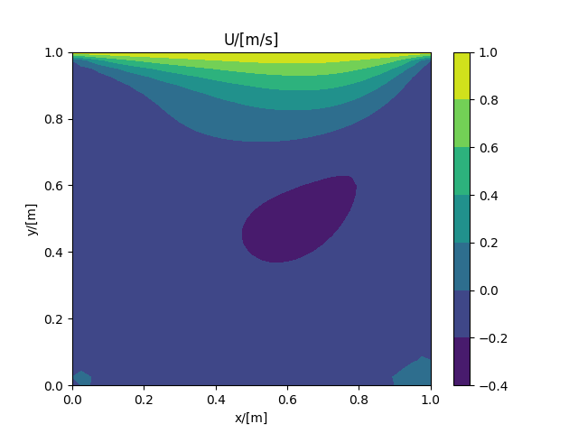  |
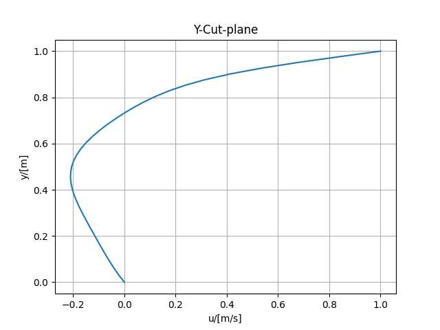  |

v-velocity             |
:-------------------------:|
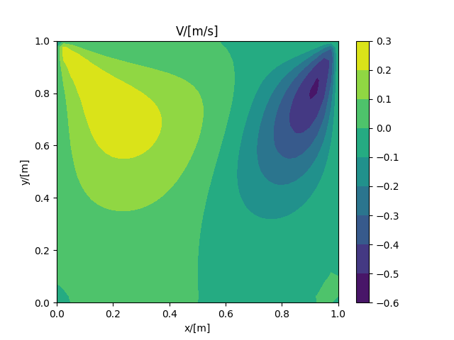 |
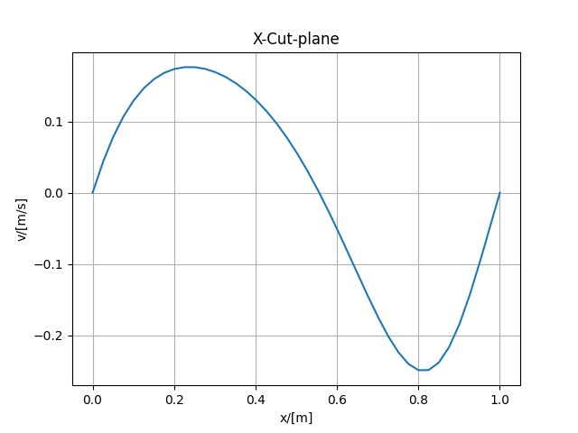 |

# Unsteady convection-diffusion equation on non-orthogonal meshes
The goal of this project is to experience the challenges of dealing with non-orthogonal meshes. For that a solver for the 2d unsteady convection-diffusion equation is implemented using the Finite-Volume method. For discretisation of the convection term HO schemes are supported. The diffusion term is discretized using a central difference scheme and the time derivative is discretized using the implizit Euler method. Details of the used methods can be found in [2]. To keep the generation of the mesh as flexible as possible the mesh format implemented by OpenFOAM is used, which also enables the use of meshing software like Ansys Meshing. Next the solution of a diffusion problem is compared between a cartesian and an unstructured triangular mesh. It can be observed that the code works with non-orthogonal problems. Furthermore a convection problem was tested. Here the solver does not converge for the unstructured mesh, which is a significant issue of the code to be fixed.

Diffusion             |
:-------------------------:|
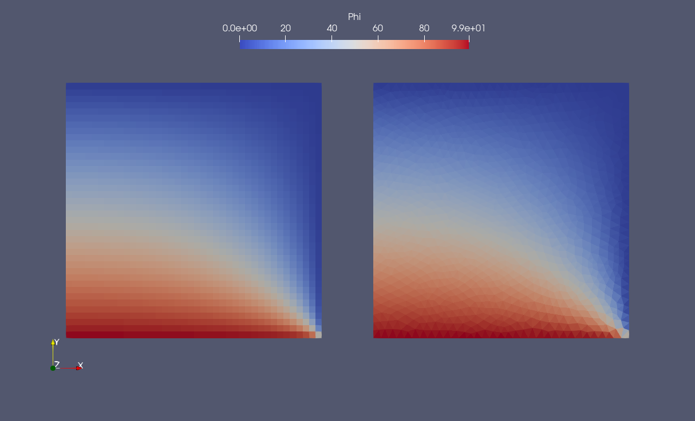 |
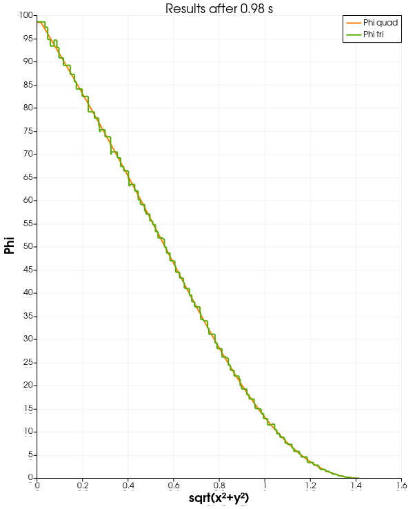 |

Convection             |
:-------------------------:|
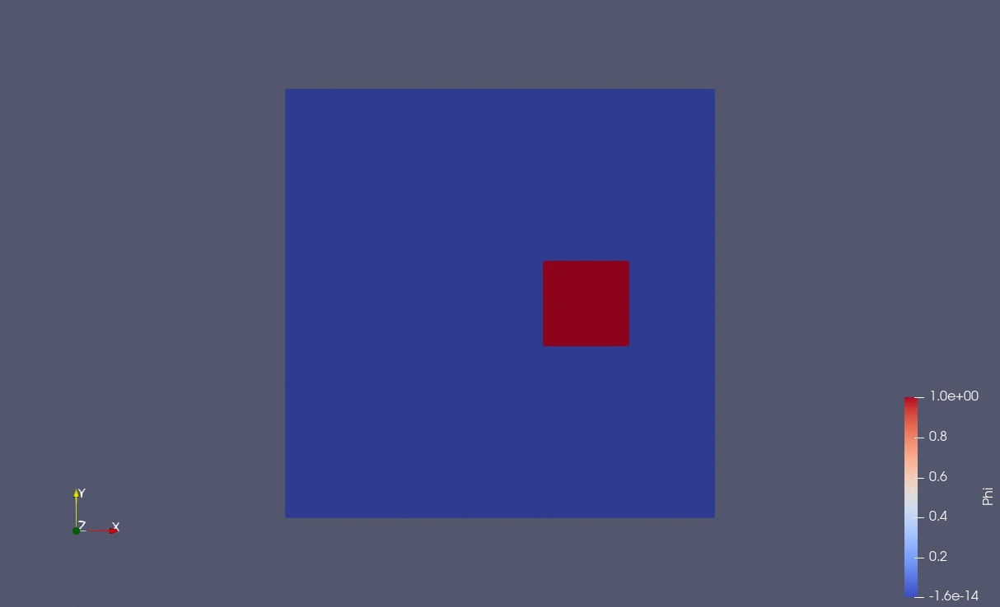 |

# Navier-Stokes using Finite-Volumes and the Simple-algorithm
This project solves the 2D unsteady and steady Navier_Stokes equations on a staggered cartesian grid. The convection term can be discretized using a upwind, central or hybrid differencing scheme. The diffusion term is discretized using central differences and the time derivative is discretized using the Adams_Moulton scheme with variable time stepping. The methods are described in [2] and [3]. The results are stored in the .vtk file format, which makes post processing in ParaView possible. Next a comparison of the velocity with data from Ghia et al. is shown for a steady state solution and a subsequent animation of u-velocity component with streamlines for the unsteady solution. All simulations have Re=100.

Steady-state            |
:-------------------------:|
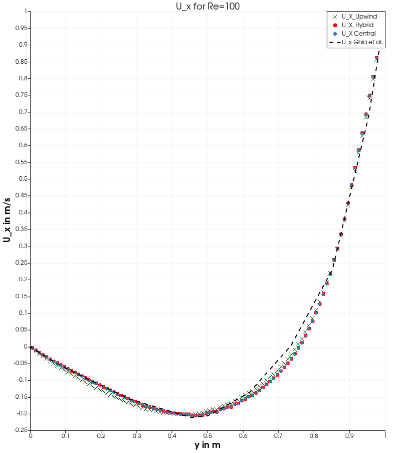 |
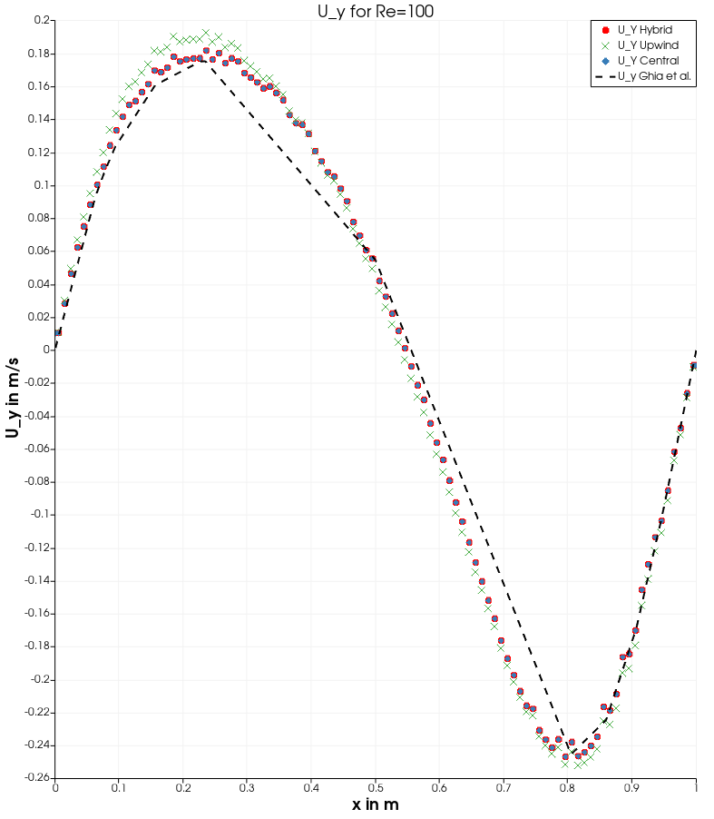 |

Unsteady            |
:-------------------------:|
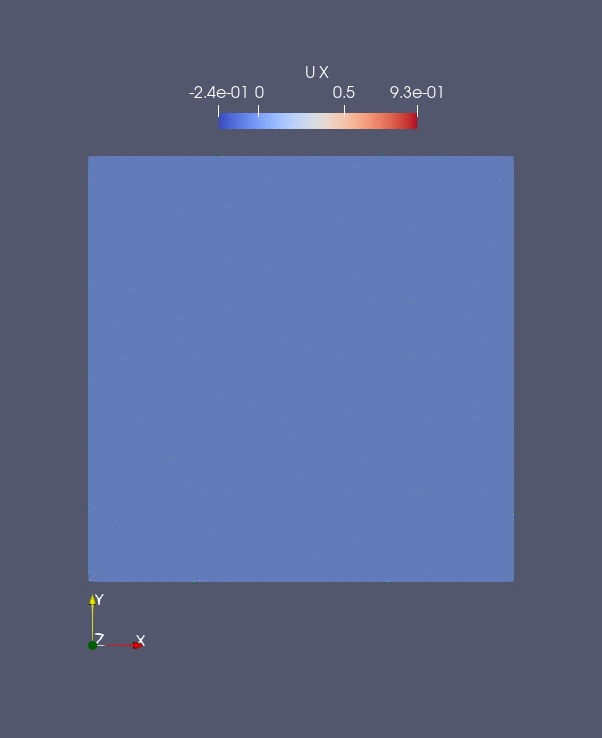 |

# GPU-Accelerated Euler-Solver
This project is based on another project completed during the course Numerical Methods for Fluid Mechanics at TU Wien. The original goal was to implement the Jameson-algorithm [5] to solve the Euler equations in a tunnel with a circular bump in Python. However this code didn't fully work, so I decided to give it another try in my free time. I reimplemented the solver in C++ and could fix the issues occuring in previous code. Furthermore the performance is improved by using GPU computing (CUDA). It seems that the code running on the GPU has a higher floating point error than the code running on the CPU, which can be fixed by increasing artificial diffusion. Next some results are shown, however the project is not fully finished yet, so proper validation and verification with literature and a performance benchmark is still pending.

Flow over circular bump           |
:-------------------------:|
 |

Flow in nozzle           |
:-------------------------:|
 |

# Literature
Literature overview |
:-------------------------:|
[1] Anderson, J. D. (1995). Computational fluid dynamics : the basics with applications (International ed.). McGraw-Hill. |
[2] Moukalled, F., Mangani, L., & Darwish, M. (2016). The finite volume method in computational fluid dynamics : an advanced introduction with OpenFOAM® and Matlab® Springer. |
[3] Versteeg, H. K., & Malalasekera, W. (2007). An introduction to computational fluid dynamics : the finite volume method (2. ed.). Pearson Prentice Hall. |
[4] Ghia, U., Ghia, K. ., & Shin, C. . (1982). High-Re solutions for incompressible flow using the Navier-Stokes equations and a multigrid method. Journal of Computational Physics, 48(3), 387–411. |
[5] Jameson, Antony & Schmidt, W. & Turkel, Eli. (1981). Solutions of the Euler Equations by Finite Volume Methods Using Runge-Kutta Time-Stepping Schemes. AIAA paper. 1259. |
